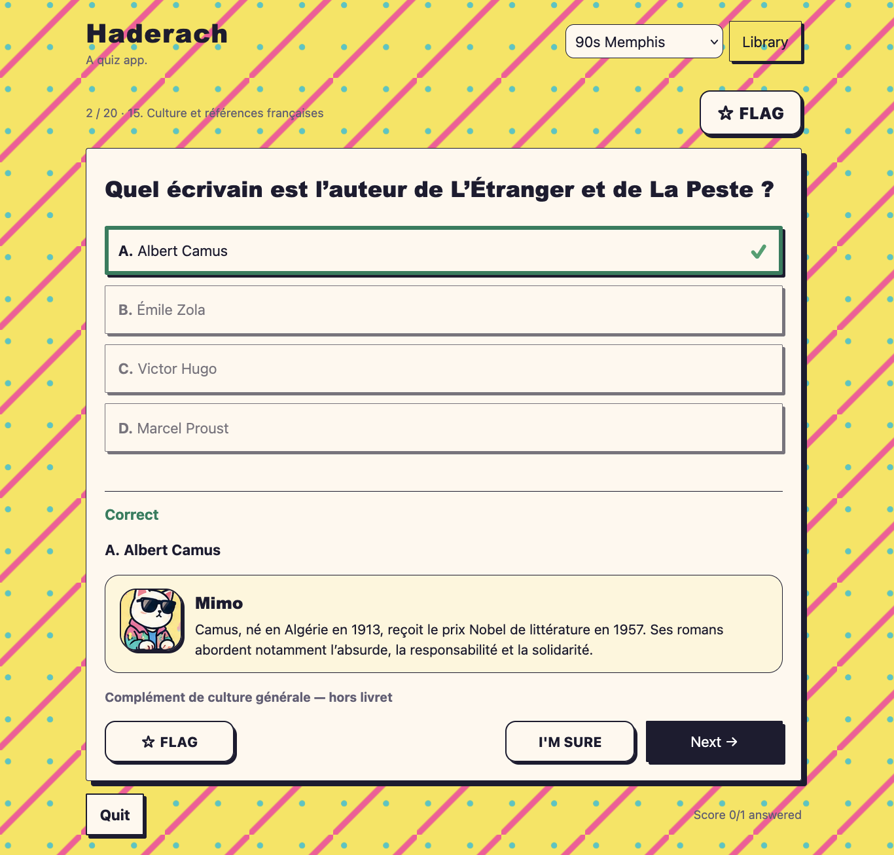

# Haderach

A quiz app!



## How to run it!

Haderach can be run as-is on any web server.

To run a downloaded copy on a computer (requires Python 3):

1. Open Terminal in the Haderach folder.
2. Paste this command and press Enter:

   ```sh
   python3 -m http.server 8000 --bind 127.0.0.1
   ```

3. Open [Haderach](http://127.0.0.1:8000) in a browser.

Keep Terminal open while using the app. Press **Ctrl+C** in Terminal to stop it.

This extra step lets the browser load the question files; double-clicking
`index.html` won't load them.

## How do I add questions?

To use Haderach, you'll need to add some question sets!

To do this, click **Add question set** in the Library, select a CSV, Excel (`.xlsx`), or JSON file, check the suggested name, and confirm.

Sets and progress are saved in the current browser on the current device. They don't sync across devices and are removed when site data is cleared.

### CSV / Excel format

Use one question per row, with A, B, C, or D in the `Correct` column. For Excel,
put the table on the first worksheet:

| Question                             | A     | B     | C         | D     | Correct | Topic     | Explanation                     | Source          |
| ------------------------------------ | ----- | ----- | --------- | ----- | ------- | --------- | ------------------------------- | --------------- |
| What is the capital of France?       | Paris | Lyon  | Marseille | Lille | A       | Geography | Paris is the capital of France. | Geography notes |
| How many sides does a triangle have? | Two   | Three | Four      | Five  | B       | Maths     | A triangle has three sides.     | Geometry notes  |

The `Topic`, `Explanation`, and `Source` are optional. A source can be a book, article, or other reference—it appears beneath the explanation after answering.

## Working on the app

The app uses plain HTML, CSS, and JavaScript. There is no build step.

- `index.html` contains the page shell, dialogs, and reusable `<template>` elements for each screen.
- `app.js` clones the templates, fills in text, and handles quiz state, imports, and saved progress.
- `style.css` contains shared component styles and responsive layouts.
- `themes.css` groups each theme’s palette and visual overrides under its named section. It loads before the shared styles.
- `sw.js` caches the app for offline use. When shipping changed assets, update their versioned URLs in `index.html` and `sw.js`, and the cache name in `sw.js`.

Keep dynamic content in JavaScript and static markup in the templates. Use `textContent` for question text and other imported content.

Formatting is defined in `.prettierrc.json`. With Node.js installed, format the source files with:

```sh
npx prettier@2.8.8 --write app.js sw.js index.html style.css themes.css README.md
```
